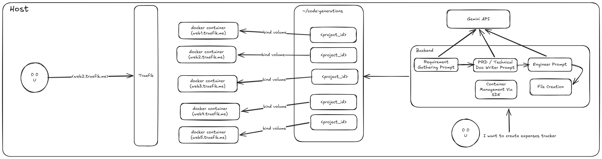

# VibeCoder

A proof-of-concept AI-powered web app generator. Describe what you want to build in plain English, and VibeCoder generates a live HTML/CSS/JS web app — served instantly in its own isolated nginx container.

## Flow



## How it works

VibeCoder uses a three-stage AI pipeline powered by Google Gemini:

1. **Planner** — Engages the user in conversation to clarify requirements before any code is written. Asks targeted questions about layout, color palette, and features until it has enough detail to proceed.
2. **Requirements generator** — Translates the conversation into a precise technical specification (layout, components, JS logic, file manifest).
3. **Code generator** — Implements the spec as vanilla HTML/CSS/JS using Tailwind CDN, writing only the files that changed (incremental diffing on subsequent prompts).

Each generated project is mounted into a dedicated nginx Docker container and routed via Traefik at a unique `<random>.traefik.me` hostname. The live preview refreshes automatically in the browser when generation completes.

## Architecture

```
code-generation/          Go backend (Gin + GORM + Gemini + Docker)
code-generation-fe/       Next.js 16 frontend (React 19 + Tailwind CSS 4)
```

### Backend (`code-generation/`)

| File | Purpose |
|------|---------|
| `main.go` | Wires up Gemini client, Postgres (GORM), Docker client, and Gin routes |
| `genai.go` | Gemini streaming client — Planner, Requirements, and Code generation agents |
| `handlers.go` | HTTP handlers for project CRUD, file serving, chat history, and SSE generation stream |
| `container.go` | Docker operations — creates and starts an nginx container per project on the `code_generation` network with Traefik labels |
| `models.go` | GORM models: `ProjectModel`, `ContainerModel`, `ProjectFileModel`, `ChatHistoryModel` |

**API endpoints**

| Method | Path | Description |
|--------|------|-------------|
| `GET` | `/ping` | Health check |
| `POST` | `/project` | Create project + spin up nginx container |
| `GET` | `/project` | List all projects |
| `GET` | `/project/:id` | Get project details |
| `DELETE` | `/project/:id` | Delete project, container, and files |
| `GET` | `/project/:id/files` | Get generated file contents |
| `GET` | `/project/:id/chat-history` | Get chat history |
| `POST` | `/action/generate-stream` | Run the AI pipeline (SSE stream) |

**SSE events from `/action/generate-stream`**

| Event | Payload | Description |
|-------|---------|-------------|
| `message` | text chunk | Streaming token from the active AI agent |
| `requirement` | text chunk | Streaming token from the requirements agent |
| `done` | JSON | Phase complete — either `{readyToExecute, response}` or `{files[]}` |
| `error` | string | Pipeline error |

### Frontend (`code-generation-fe/`)

Single-page React app with two views:

- **Homepage** — prompt input, project name, and a gallery of previous projects
- **Editor** — resizable chat/files sidebar + live iframe preview of the generated app

The frontend proxies all API calls through Next.js route handlers (`/app/api/`) to the Go backend on `localhost:8080`.

## Prerequisites

- Docker with the `code_generation` network available
- Go 1.25+
- Node.js 18+
- A Google Gemini API key

## Setup

**1. Create the Docker network** (one time)

```bash
docker network create code_generation
```

**2. Start infrastructure**

```bash
cd code-generation

# Traefik reverse proxy (routes <random>.traefik.me → nginx containers)
docker compose -f traefik-compose.yml up -d

# PostgreSQL
docker compose -f docker-compose.yaml up -d
```

**3. Configure the Gemini API key**

```bash
export GEMINI_API_KEY=your_api_key_here
```

**4. Run the backend**

```bash
cd code-generation
go run .
# or with live reload:
air
```

The server starts on `localhost:8080`.

**5. Run the frontend**

```bash
cd code-generation-fe
npm install
npm run dev
```

Open `http://localhost:3000`.

## Usage

1. Enter a project name and describe what you want to build (e.g. *"A dashboard for tracking SaaS metrics with a dark theme"*).
2. The Planner may ask clarifying questions — answer them to refine the spec.
3. Once requirements are clear, the AI generates the code and the preview loads automatically.
4. Iterate: send follow-up prompts in the chat to update or extend the app.
5. Browse generated files in the **Files** tab; click any file to view its source.

## Tech stack

| Layer | Technology |
|-------|-----------|
| AI | Google Gemini 2.5 Pro (`google.golang.org/genai`) |
| Backend | Go, Gin, GORM, moby Docker client |
| Database | PostgreSQL 17 |
| Proxy | Traefik v3 |
| App serving | nginx (one container per project) |
| Frontend | Next.js 16, React 19, Tailwind CSS 4, TypeScript |

## Notes

- This is a **proof of concept**. The database DSN is hardcoded in `main.go`; the Gemini API key is read from the `GEMINI_API_KEY` environment variable.
- Generated projects are stored at `~/code-generation/<projectId>/` on the host and bind-mounted into nginx containers.
- Each project hostname follows the pattern `<random8chars>.traefik.me`, which resolves publicly to `127.0.0.1` — no DNS configuration needed for local development.
